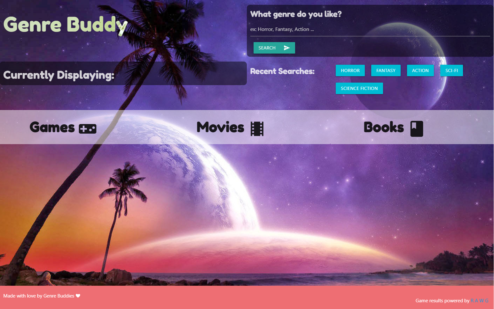

# Genre Buddy

Genre Buddy is a web application designed for fans of certain genres as well as users who want to explore new genres. By searching a genre, the user gets results for recent books, games, and movies.
We used three different third party API's that would help us give our users differnt media options. For books we used [Hapi Books](https://rapidapi.com/roftcomp-laGmBwlWLm/api/hapi-books/), which shows users the top books of the past week based off the genre they choose. Hapi Books displays the name and cover picture of the book, as well as a link that takes users to the book's listing on goodreads.com.
For movies we used [IMDB-API](https://imdb-api.com/), this allows users to see the top movies in a specific genre from the past month. It also gives the user a rating of the movie from the IMDB database as well as the movie poster.
Lastly, we used [RAWG](https://rawg.io/apidocs) videogames database API for videogames. This API chooses the top recent games, the cover art of the games, and what gaming platforms it is available on.
Using the application is simple. All the user has to do is type a genre of their choosing into the search bar and Genre Buddy will display videogames, movies, and books in that genre. It will also save the users last searches so they can view them at a later time if they desire.

For feature development it would be a good idea to look into possibly having the age ratings for the games and movies so that the users are able to accurately chose an age appropiate form of media. There are also a few visual things that could use improvement such as the background images not fitting mobile screens, and the background images zooming in and becoming distorted once a search is done.

This project was made with the joint effotrts of Max Taylor, Cristina Dege, Griffin Honeycutt, Sam Rebilas, Garcendy Deroiser and Austin Small

[Link to Genre Buddy](https://maxbransontaylor.github.io/genre-buddy/)
